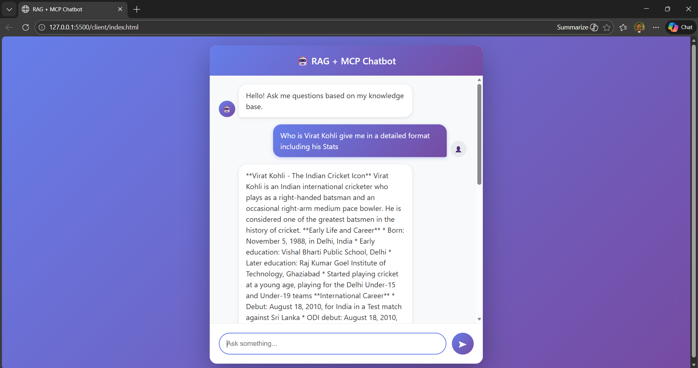
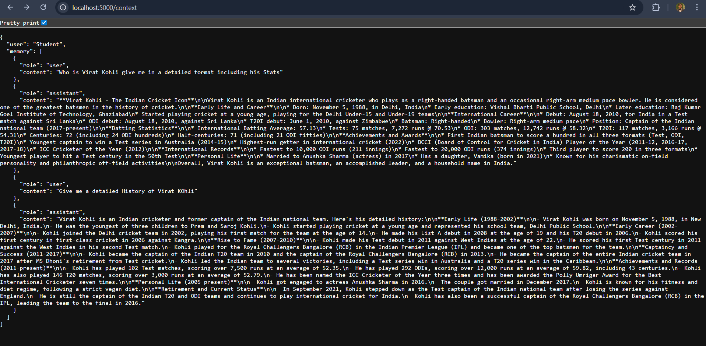

<p align="center">
  
  
  
  
</p>

<p align="center">
  
  
  
</p>

<p align="center">
  
</p>

<h1 align="center">🕸️ RAG + MCP Chatbot 🕷️</h1>

<p align="center">
  <i>"With great power comes great responsibility."</i><br/>
  <b>A Real-World AI Chatbot built using RAG, MCP & LLMs</b>
</p>

<p align="center">
  
</p>

---

## 🎵 Theme Song : *Sunflower 🌻*  
### *(Spider-Man: Into the Spider-Verse)*

<p align="center">
  🎧 <b>Play the theme while exploring the project:</b><br/>
  <a href="https://youtu.be/ApXoWvfEYVU?si=fdLLyefHJ6yD-ifM" target="_blank">
    
  </a>
</p>

---

## 🧠 Project Overview

**SpiderVerse RAG + MCP Chatbot** is a **full-stack AI chatbot** built for:

- 🎓 University workshops  
- 🧪 Hands-on AI demonstrations  
- 🧠 Understanding **RAG (Retrieval Augmented Generation)**  
- 🔗 Learning **MCP-style context & memory handling**

Just like Spider-Man, this chatbot is:
> **Powerful, controlled, and responsible.**

---

## 🕸️ Architecture (Spider-Sense View)

```

🧑 User (Browser)
↓
🕷️ HTML / CSS / JS 
↓
🧠 MCP Server (Node.js + Express)
↓
📚 RAG Knowledge Retriever
↓
🤖 LLM (Groq / OpenAI-Compatible)

```

<p align="center">
  
</p>

---

## 🖼️ Screenshots

### 🕷️ Chatbot Interface (Frontend)


---

### 🧠 MCP + RAG Backend Flow


---

## 🛠️ Tech Stack

| Layer | Technology |
|------|------------|
| Frontend | HTML, CSS, JavaScript |
| Backend | Node.js, Express |
| AI Layer | Groq / OpenAI-Compatible LLM |
| RAG | Custom JavaScript Retriever |
| MCP | Context + Memory Management |

---

## 🚀 How to Run Locally

### 1️⃣ Install Backend Dependencies
```bash
cd server
npm install
````

---

### 2️⃣ Add API Key

Create a `.env` file inside `server/`:

```env
OPENAI_API_KEY=your_api_key_here
```

⚠️ **Never commit `.env` to GitHub**

---

### 3️⃣ Start MCP Server

```bash
node server.js
```

Expected output:

```
🤖 RAG + MCP server running on port 5000
```

---

### 4️⃣ Open Frontend

Open:

```
client/index.html
```

✅ Recommended: **Open with Live Server**

---

## 🧪 Try These Questions

```
What is blockchain?
What is MCP?
Why is RAG important?
What is Bitcoin price?
```

✔ Grounded answers
✔ No hallucinations
✔ Real AI behavior

---

## 🧑‍🏫 Workshop Usage

This project is designed for:

* AI & System Design workshops
* MCP & RAG live demonstrations

Students can:

* Edit `data.js`
* Add new knowledge
* Observe AI behavior change instantly

---

## 🔐 Academic Safety

* ❌ No cryptocurrency usage
* ❌ No wallets or transactions
* ❌ No personal data storage
* ✅ Safe for college labs

> 🕷️ *With great AI power comes great system design.*

---


## 👤 Author

**Jeevan Ramesh Jadhav**<br>
🕷️ Workshop Speaker & Developer<br>
Topic: *RAG, MCP & Real-World AI Systems*

---

## 📜 License

MIT License © 2026

---

<p align="center">
  
</p>

<h3 align="center">🕷️ Thanks for swinging by the SpiderVerse 🕷️</h3>

<p align="center">
  <i>Built with responsibility. Designed with intelligence.</i><br/>
  <b>RAG • MCP • AI • Systems</b>
</p>
